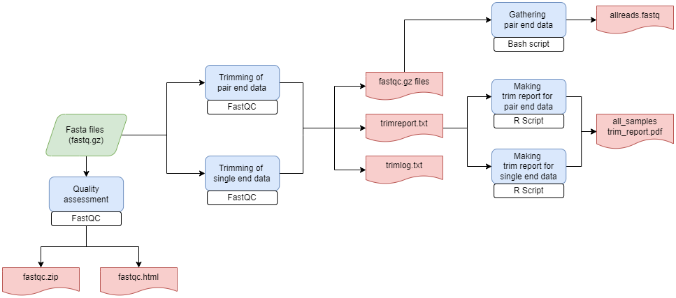

# **fastq_QC_processing**

Nextflow pipeline to analyze and modify fastq sequence quality

------------------------------------------------------------------------

### Workflow overview

------------------------------------------------------------------------

### Input 

Directory path with .fastq.gz sequences

Output directory path

### Output 

Main output: PDF Trim report 

------------------------------------------------------------------------

### Requirements

Compatible OS*:
Ubuntu 20.04 LTS
Ubunto 18.04 LTS

### Software

| Requierment | Version | Required Commands * |
|-------------|---------|---------------------|
|Java| v11.0.11 |java |
|Nextflow | 21.10.5 | nextflow run |
|Trimmomatic| v0.39 |java  -jar ILLUMINACLIP, AVGQUAL, LEADING, TRAILING, SLIDINGWINDOW, MINLEN|
| Fastqc |v0.11.9 | fastqc |
|Plan9port| Latest (as of 10/01/2019 ) | mk ** |
|R | v 4.1.2 | Rscript |
|pandoc | 2.5 | pandoc |
|pdfLatex | - | compiling LaTeX into PDF |

* These commands must be accessible from your $PATH (i.e. you should be able to invoke them from your command line).
** Plan9 port builds many binaries, but you ONLY need the mk utility to be accessible from your command line.

#### R packages requierments

| R package | Function |
|-----------|----------|
| rmarkdown | render |
| dplyr |magrittr, filter(), mutate(), select(), arrange() |
| knitr | kable|
| kableExtra | kable_styling |
| tidyr |pivot_longer() |
| scales | colour pallettes |
| ggplot2 | geom_col( ), ggplot() |
| vroom | vroom () |
| cowplot | theme_cowplot() |

### Installation

Download fastq_QC_processing from Github repository:

    git clone https://github.com/Iaguilaror/fastq_QC_processing.git

------------------------------------------------------------------------

#### Test

To test fastq_QC_processing execution using test data, run:

    ./runtest.sh 

Your console should print the Nextflow log for the run, once every
process has been submitted, the following message will appear:

     ======
     Basic pipeline TEST SUCCESSFUL
     ======

results for test data should be in the following directory:

    ./fastq_QC_processing/test/results/fastq_quality_control-results

------------------------------------------------------------------------

### Usage

To run with your own data go to the pipeline directory and execute:

    nextflow run fastq_quality_control.nf \
	--input_dir $your_input_dir \
	--output_dir $your_output_directory \
	-resume \
	-with-report $your_output_directory/`date +%Y%m%d_%H%M%S`_report.html \
	-with-dag $your_output_directory/`date +%Y%m%d_%H%M%S`.DAG.html  
	

### Important

Params for trimming must be modified in the nextflow.config file

Meaning: trim_avgqual, trim_leading, trim_trailing, etcetera. 

------------------------------------------------------------------------

For information about options and parameters, run:

    nextflow run fastq_quality_control.nf --help

------------------------------------------------------------------------

#### Authors

Israel Aguilar Ordonez
